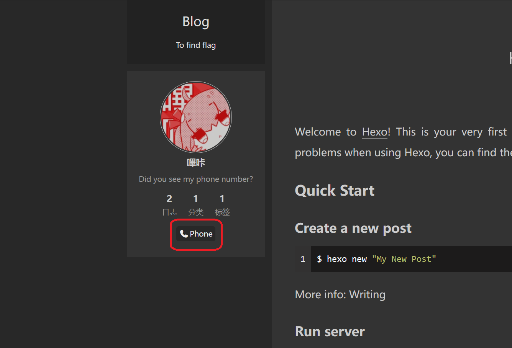
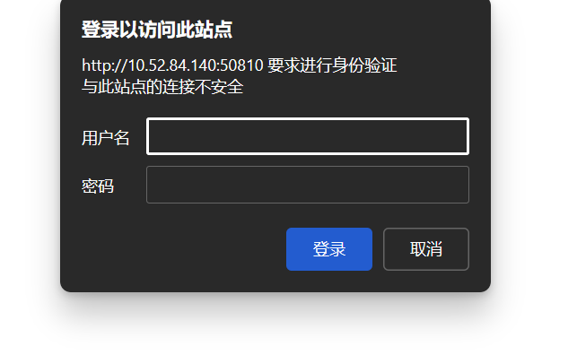
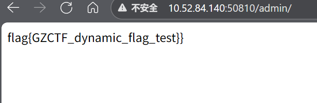

# password_leak&user_login

原地址：[GZCTF-challenges/password_leak&user_login](https://github.com/DeadlyUtopia/GZCTF-challenges/tree/main/password_leak%26user_login)

等待服务开启后，访问网站

左侧的`Phone`可以得到一串数字

访问 `IP:PORT/admin` 或者 `IP:PORT/admin/` 试图进入模拟后台

用户名：`admin` 密码：`{Phone给的一串数字}`

登录后得到flag

