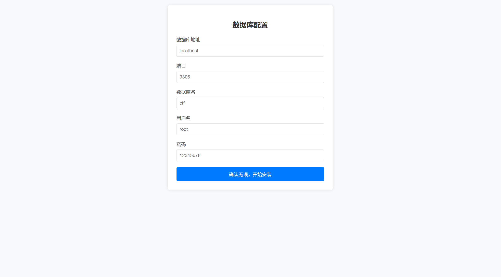
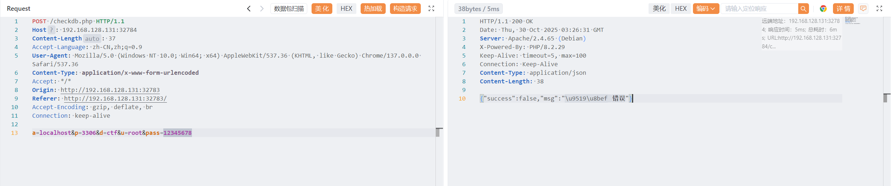
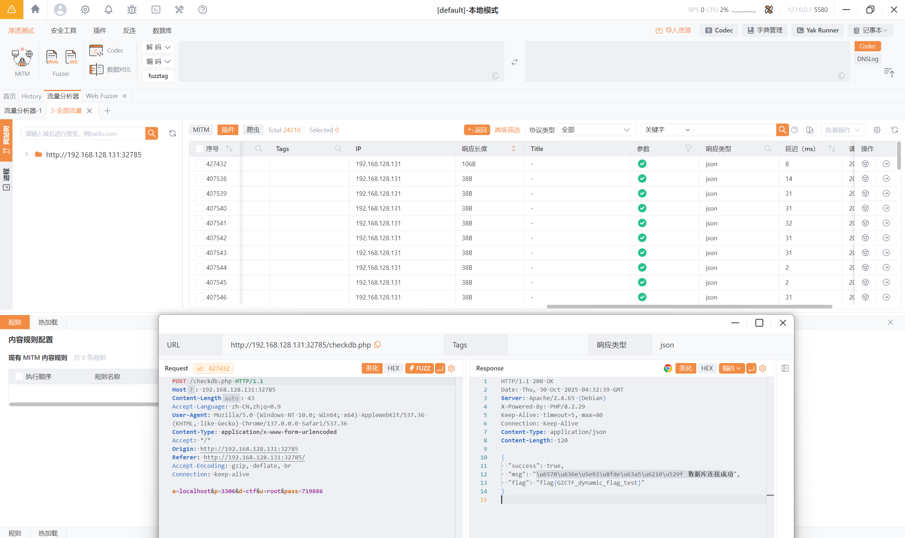

# simple_db_pass_bruteforce

原地址：[GZCTF-challenges/simple_db_pass_bruteforce](https://github.com/DeadlyUtopia/GZCTF-challenges/tree/main/simple_db_pass_bruteforce)

打开页面是如下内容



点击按钮 `确认无误，开始安装` 使用 bp 抓取请求包

```HTTP
POST /checkdb.php HTTP/1.1
Host: IP:PORT
Content-Length: 37
Accept-Language: zh-CN,zh;q=0.9
User-Agent: Mozilla/5.0 (Windows NT 10.0; Win64; x64) AppleWebKit/537.36 (KHTML, like Gecko) Chrome/137.0.0.0 Safari/537.36
Content-Type: application/x-www-form-urlencoded
Accept: */*
Origin: http://192.168.128.131:32783
Referer: http://192.168.128.131:32783/
Accept-Encoding: gzip, deflate, br
Connection: keep-alive

a=&p=&d=&u=&pass=
```

使用默认值发送看看

```http
POST /checkdb.php HTTP/1.1
Host: IP:PORT
Content-Length: 37
Accept-Language: zh-CN,zh;q=0.9
User-Agent: Mozilla/5.0 (Windows NT 10.0; Win64; x64) AppleWebKit/537.36 (KHTML, like Gecko) Chrome/137.0.0.0 Safari/537.36
Content-Type: application/x-www-form-urlencoded
Accept: */*
Origin: http://192.168.128.131:32783
Referer: http://192.168.128.131:32783/
Accept-Encoding: gzip, deflate, br
Connection: keep-alive

a=localhost&p=3306&d=ctf&u=root&pass=123456
```

```http
HTTP/1.1 200 OK
Date: Thu, 30 Oct 2025 03:26:31 GMT
Server: Apache/2.4.65 (Debian)
X-Powered-By: PHP/8.2.29
Keep-Alive: timeout=5, max=100
Connection: Keep-Alive
Content-Type: application/json
Content-Length: 38

{"success":false,"msg":"\u9519\u8bef"}
```



接下来进行密码爆破 *~~（由于我们知道后端代码是范围从567890到952700，所以直接爆破这个范围，通常实际更接近于从000000一直到爆破到999999。可以直接进入容器  `cat /etc/ctfconfig/password.txt` 查看密码方便调试）~~*



爆破出密码是什么，就能在返回包里看到 flag 了（注：在 index.php 就算直接知道密码也看不到flag，需要抓包才行）