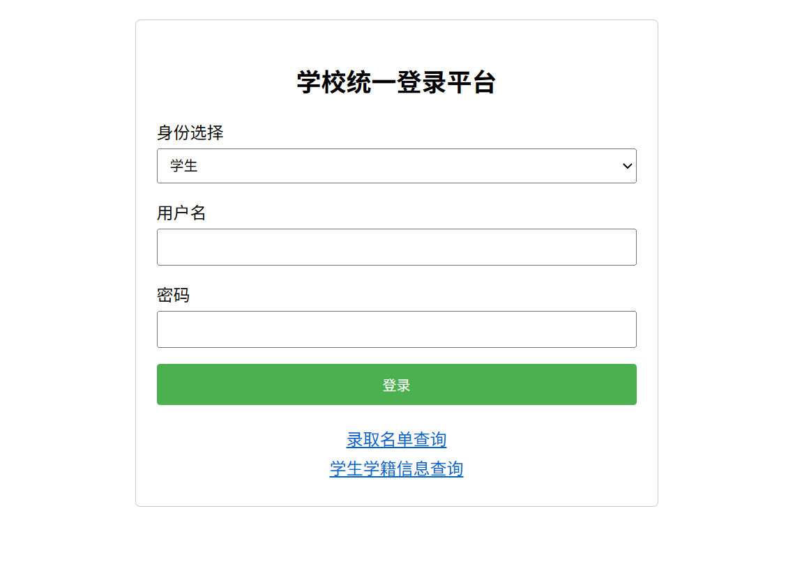
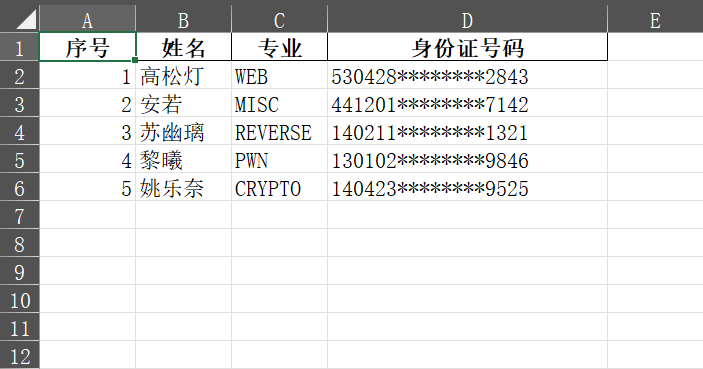
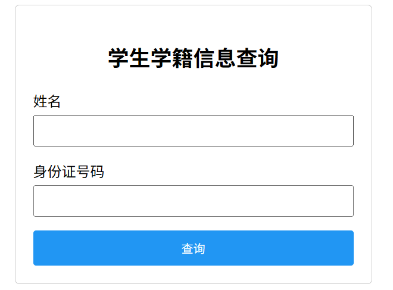
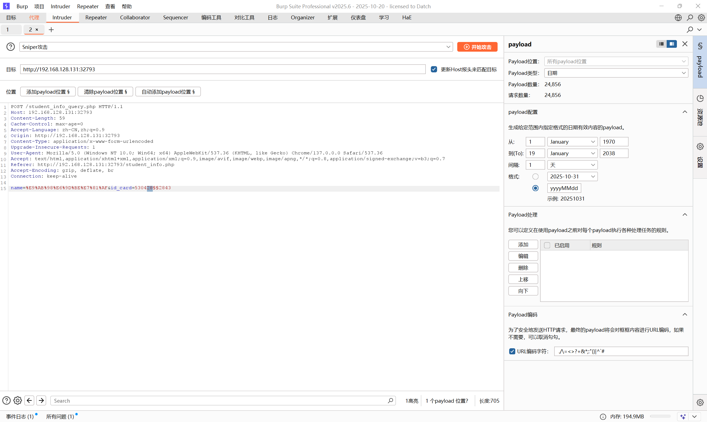
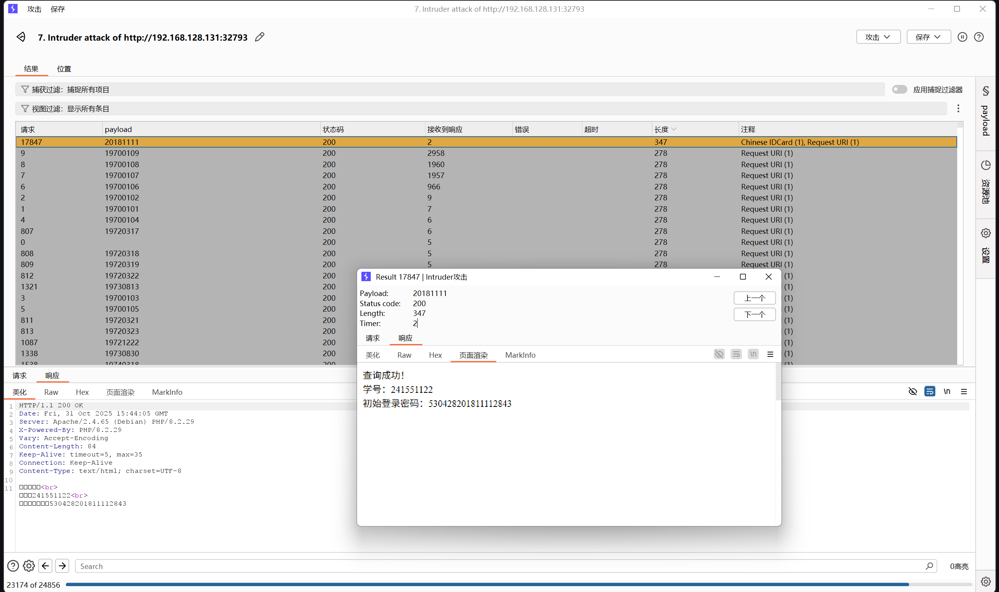
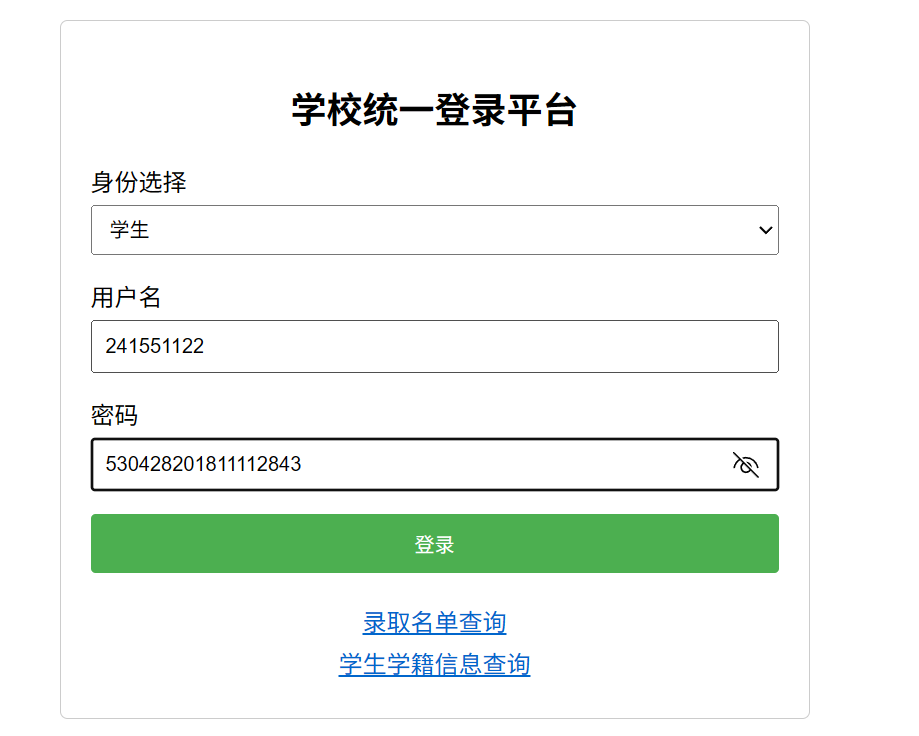
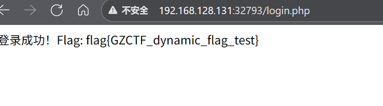

# simple_date_birth_brute

原地址：[GZCTF-challenges/simple_date_birth_brute](https://github.com/DeadlyUtopia/GZCTF-challenges/tree/main/simple_date_birth_brute)

访问容器网页，如下内容



点击 `录取名单查询`，获取 excel 文件，如下内容



可以看见其中的出生年月日信息被抹除了，接下来先看下 `学生学籍信息查询`



查询信息需要姓名和身份证号，我们通过爆破来爆破出完整的身份信息，先使用 bp 捕获一个请求包

```http
POST /student_info_query.php HTTP/1.1
Host: IP:PORT
Content-Length: 59
Cache-Control: max-age=0
Accept-Language: zh-CN,zh;q=0.9
Origin: http://IP:PORT
Content-Type: application/x-www-form-urlencoded
Upgrade-Insecure-Requests: 1
User-Agent: Mozilla/5.0 (Windows NT 10.0; Win64; x64) AppleWebKit/537.36 (KHTML, like Gecko) Chrome/137.0.0.0 Safari/537.36
Accept: text/html,application/xhtml+xml,application/xml;q=0.9,image/avif,image/webp,image/apng,*/*;q=0.8,application/signed-exchange;v=b3;q=0.7
Referer: http://IP:PORT/student_info.php
Accept-Encoding: gzip, deflate, br
Connection: keep-alive

name=%E9%AB%98%E6%9D%BE%E7%81%AF&id_card=530428********2843
```

接下来爆破~~*（因为知道后端生成范围为 1970-01-01 至 2038-01-19 ，所以直接用这个范围）*~~





爆破出完整信息（学号、密码），接下来登录





得到 flag