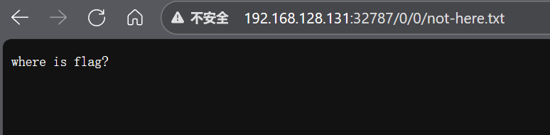
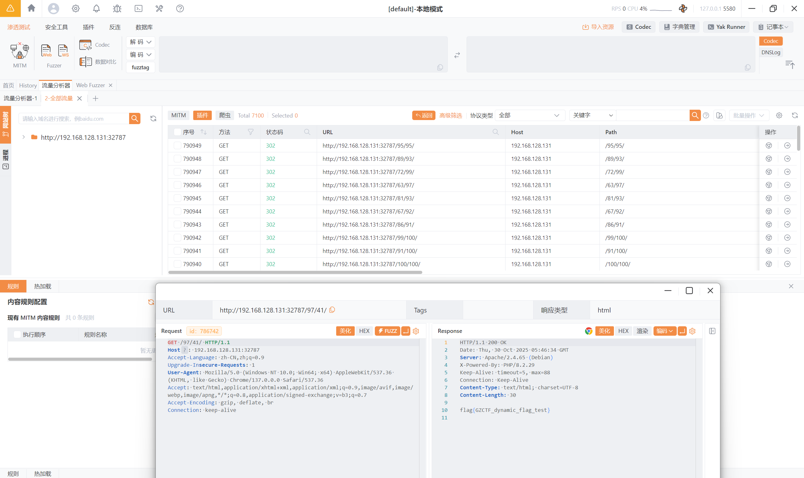

# simple_dir_brute

原地址：[GZCTF-challenges/simple_dir_brute](https://github.com/DeadlyUtopia/GZCTF-challenges/tree/main/simple_dir_brute)

访问网页，如下内容



自动跳转 `IP:PORT/0/0/not-here.txt` 路径并显示 `where is flag?`

这题是目录爆破*~~（范围 **1-100**）~~*

使用 bp 抓个请求包先

```http
GET /0/0/ HTTP/1.1
Host: IP:PORT
Accept-Language: zh-CN,zh;q=0.9
Upgrade-Insecure-Requests: 1
User-Agent: Mozilla/5.0 (Windows NT 10.0; Win64; x64) AppleWebKit/537.36 (KHTML, like Gecko) Chrome/137.0.0.0 Safari/537.36
Accept: text/html,application/xhtml+xml,application/xml;q=0.9,image/avif,image/webp,image/apng,*/*;q=0.8,application/signed-exchange;v=b3;q=0.7
Accept-Encoding: gzip, deflate, br
Connection: keep-alive
```

成功爆破



yakit 爆破请求包

```
GET /{{int(1-100)}}/{{int(1-100)}}/ HTTP/1.1
Host: IP:PORT
Accept-Language: zh-CN,zh;q=0.9
Upgrade-Insecure-Requests: 1
User-Agent: Mozilla/5.0 (Windows NT 10.0; Win64; x64) AppleWebKit/537.36 (KHTML, like Gecko) Chrome/137.0.0.0 Safari/537.36
Accept: text/html,application/xhtml+xml,application/xml;q=0.9,image/avif,image/webp,image/apng,*/*;q=0.8,application/signed-exchange;v=b3;q=0.7
Accept-Encoding: gzip, deflate, br
Connection: keep-alive
```

爆破目录，然后得到 flag